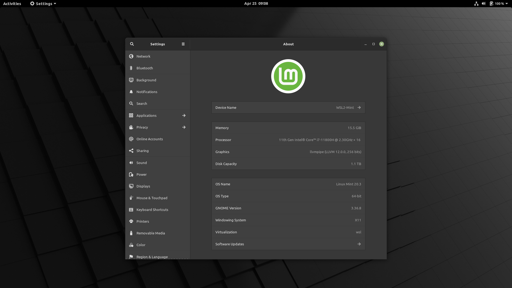

# Linux Mint 20.3 WSL2

A pre-configured `GNOME` desktop environment (DE) incorporating `VcXsrv Windows X Server` and `PulseAudio` passthrough.

## Installation

Ensure that you have `WSL2`, `VcXsrv Windows X Server`, and `7-Zip` installed before you continue with the steps below:

1. Open the `GitHub` [releases](https://github.com/milesbuckton/wsl2-mint/releases) tab and download all the `mint.tar.gz` files from the `v20.3` release assets.
2. Copy the `mint.tar.gz` files to the `sources` folder.
3. Run `extract.bat` to extract the distribution.
4. Run `import.bat` to import the distribution.
5. Run `boot.bat` to start `Linux Mint 20.3` with `PulseAudio`.

## Notes

* To log into the Linux instance simply type `gnome-session` in the Terminal after you have run `boot.bat`.
* To terminate the Linux instance simply log out of `GNOME`, and type `exit` in the Terminal.
* The default `user` credentials are: `user:mint` `root:mint`.

## Troubleshooting

If you're having issues getting the distribution to display, ensure that the Windows Firewall is granted `Public` and `Private` network access.
